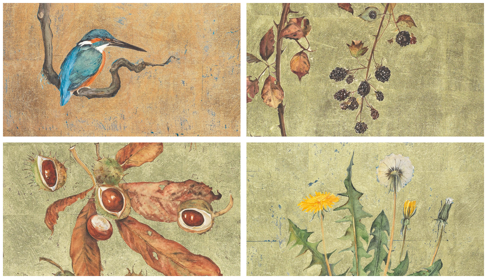

# Lost Words

An Omarchy theme inspired by the illustrations in *The Lost Words*: deep woodland backgrounds, warm parchment text, antique gold accents, moss green, chestnut, and kingfisher blue.



## Install

```bash
omarchy theme install https://github.com/dtt101/omarchy-lost-words-theme
```

The theme installs as `lost-words`. Omarchy generates application colours from `colors.toml`; use a version supporting this palette format.

To apply it again or cycle the four wallpapers:

```bash
omarchy theme set lost-words
omarchy theme bg next
```

## Wallpapers

Four 2560 x 1440 landscape wallpapers: Kingfisher, Bramble, Conker, and Dandelion. These contain only the illustrations: no poems, headings, logos, or poster footers.

The original JPEG image objects were extracted directly from the downloaded poster PDFs without recompression. Each original is 1597 x 2176 pixels and is preserved in `artwork/`. The desktop versions use selected 1597 x 898 landscape crops, resized with Lanczos to 2560 x 1440 and saved as high-quality JPEGs. This is an enlargement of the available source detail, not native 1440p artwork. The botanical wallpapers show details of the taller paintings; full compositions remain in `artwork/`.

The Explorer's Guide contains much smaller illustrations, so its images were not used for desktop backgrounds. No AI-generated or repainted imagery is included.

## Palette

| Role | Colour |
| --- | --- |
| Woodland background | `#17221f` |
| Parchment foreground | `#e9e3ce` |
| Antique gold accent | `#d4b66a` |
| Moss green | `#a4b77c` |
| Chestnut | `#b69472` |
| Kingfisher blue | `#77acc3` |

## Artwork and credits

Illustrations by Jackie Morris, from *The Lost Words* by Robert Macfarlane and Jackie Morris. This is an unofficial personal theme. Artwork remains the property of its respective copyright holders and is not covered by the theme configuration's MIT license. See [CREDITS.md](CREDITS.md) for source details and [sources.json](sources.json) for extraction records.
